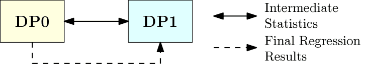
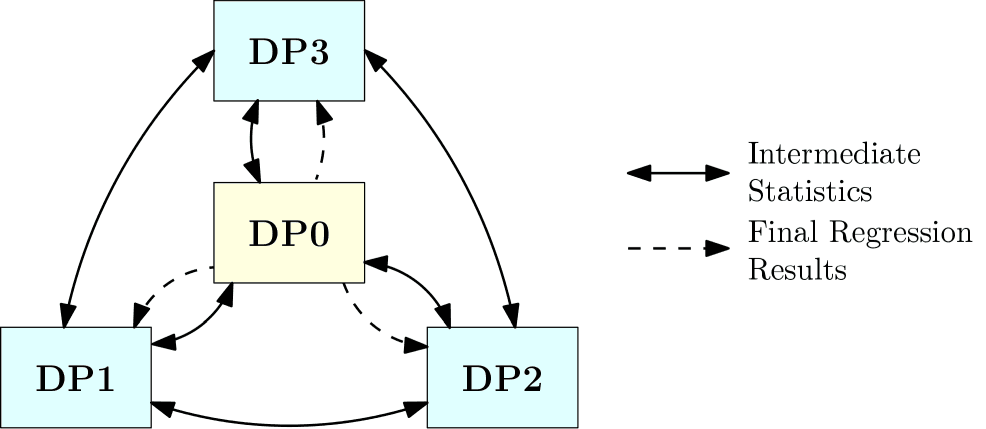

```{r, echo = FALSE, warning=FALSE}
library(knitr)
```

# Background

In medical research, it is common for researchers to gather data from multiple sources.  However, due to privacy concerns (e.g. HIPAA) or the propitiatory nature of the data, one or more of the potential sources may not be in a position to share the data.  Various methods have been proposed in the literature, and some R packages have been written (e.g `distcomp`, `ppmHR`), which allow analyses to be performed on distributed data in a secure setting.  That is, the analyses are performed as if the data were aggregated, but in reality each data partner maintains control over their own data and only shares high level statistics in such a way that the original data cannot be deduced by the other data partners.

Each of these methods assumes that the data is horizontally partitioned.  That is, each data partner has the same response variable and covariates for distinct cohorts.  What makes this package novel is that we assume that the data is vertically partitioned.  That is, each data partner holds a set of unique covariates for the same cohort of observations.  (One way to think about this is with horizontally partitioned data, the observation matrix is partitioned by horizontal lines and in vertically partitioned data, the observation matrix is partitioned by vertical lines.)

In this package, we implement three different protocols for vertical distributed regression analysis (VDRA) in a secure setting.  They are called $2$-party, $2^T$-party, and $k^T$-party.  Each of these protocols can be used to perform linear, logistic, and Cox regression.  The purpose of this vignette is to demonstrate how to use this package, so we will not go into details of the protocols and algorithms here.  Specific information on the algorithms and a discussion of their security can be found in the following papers:

* *Automatable Distributed Regression Analysis of Vertically Partitioned Data Facilitated by PopMedNet: A Feasibility and Enhancement Study*, (doi: 10.2196/21459), Q.\ Her, T.\ Kent, Y.\ Samizo, A.\ Slackovic, S.\ Toh, Y.\ Vilk, submitted to Journal of Medical Internet Research	 
* *Distributed Regression Analysis on Vertically Partitioned Data in R*, Q.\ Her, T.\ Kent, Y.\ Samizo, A.\ Slackovic, S.\ Toh, Y.\ Vilk, in preparation.  

## Dependencies

This package was designed to run in Base-R.  However, there are select cases when using functions from the `survival` package is possible.  In these cases, if the `survival` package is installed, those functions will be used, otherwise, we use our own functions.

## A Word of Caution

When using this package on PopMedNet, the computations can take tens of minutes for linear regression on a data set with a few thousand observations, to hours for Cox regression on a data set with hundreds of thousands, or millions of observations.  Even when running the simulation on your local computer using the PopMedNet simulator `pmn()`, the computations can take several minutes.  These times are due to the large about of data that needs to be transferred back and forth between the data partners in order to ensure that the computations are secure and that there is no data leakage.  If one were able to aggregate the data from the different data sources without concern for privacy, then they would do so and use more efficient functions.  However, there is no free lunch, and the price for security and privacy is time.  So, when working through the examples in this vignette, grab a drink, put on some nice music, and find pleasure in the journey.

## $2$-party VDRA

With $2$-party VDRA, there are only two data holders, DP0 and DP1 (short for "Data Partner 0" and "Data Partner 1").  This protocol allows DP0 and DP1 to communicate directly with each other, but they never share patient level data with each other nor information which would allow the other party to deduce patient level information.  DP0 and DP1 share intermediate statistics with each other multiple times in an iterative manner until the final regression results are computed by DP0 and shared with DP1.  A pictorial representation of the data flow between the parties is shown below.

```{r, echo = FALSE, message=FALSE, out.width="75%", fig.align='center', fig.pos='H'}

```

The name DP0 indicates which party is acting as the analysis center.  This is the only protocol where the analysis center also provides data.  For the next two protocols, the analysis center does not provide any data.

## $2^T$-party VDRA

With $2^T$-party VDRA, there are only two data holders, DP1 and DP2, and an analysis center, DP0.  DP1 and DP2 cannot communicate directly with each other, but all communication must pass through DP0.  DP0 is a trusted third party that helps facilitate communication and performs much of the computation that was performed by DP1 in the $2$-party protocol.  Whenever possible, any intermediate statistics shared with DP0 from one data partner (never patient level data) are multiplied by a random orthonormal matrix before being sent to the other data partner.  This adds an extra layer of security at the expense of sending more data.  The final regression results are computed by DP0 and shared with DP1 and DP2.  A pictorial representation of the data flow between the parties is shown below.  

```{r, echo = FALSE, message=FALSE, out.width="75%", fig.align='center', fig.pos='H'}
knitr::include_graphics("2Tparty.png")
```

## $k^T$-party VDRA

With $k^T$-party VDRA, there are two or more data holders, DP1, DP2, ... DPk, and one analysis center, DP0.  We have tested the package with up to 10 data holders, but there is no reason why there could not be more.  With this protocol, all data partners are able to communicate with each other with the benefit that less data is transferred.  As with $2^T$-party VDRA, DP0 facilitates the computations and computes the final regression results, which are then sent to all the data partners.  The one possible concern with this method is that a data breach at both the analysis center and one of the data partners could expose another data partner's data, even though neither the analysis center nor any data partner have enough information to reconstruct any part of any other data partners' data on their own.  A pictorial representation of the data flow between the parties is shown below.  

```{r, echo = FALSE, message=FALSE, out.width="75%", fig.align='center', fig.pos='H'}

```

# PopMedNet and the PopMedNet Simulator

PopMedNet (https://pmnplayground-1.popmednet.org/), short for Population Medicine Network, is a "scalable and extensible open-source informatics platform designed to facilitate the implementation and operation of distributed health data networks."  PopMedNet is maintained by Department of Population Medicine at the Harvard Medical School and the Harvard Pilgrim Health Care Institute.  Through two generous National Institute of Health Grants, we were able to make modifications to PopMedNet which allowed us to transmit data between data partners in a secure and automatic fashion.  These modification were made specifically with the intent of the creation of this package.  While this package has been designed to work seamlessly with PopMedNet as a means of communication, it should be possible to use other file transfer software to perform the same task.

If a group of data partners wishes to use PopMedNet and this package for analysis of vertically distributed data, please refer to the vignette "How to Use the VDRA Package with PopMedNet" for further information.  However, for the individuals which are interested in testing out the package to see how it works, a PopMedNet simulator, `pmn()`, has been supplied as part of the package.  This allows the individual to play the part of the all the data partners and the analysis center on a single computer in order to gain an understanding of how to use the package before implementation in a real world setting.

We demonstrate the usage of this package using `pmn()` as the file transfer protocol for $2$-party, $2^T$-party, and $k^T$-party situations.  Take careful note the use of the parameter `popmednet = FALSE` in all function calls.  When `popmednet = TRUE` is used, an offset is added to make sure that when two or more data partners are running in parallel, there is a at least a 15 second window between when they signal PopMedNet that they are ready to upload files.  There are technical reasons for this that are specific to PopMedNet, but are not applicable when other file transfer protocols are utilized.

# Data

The `VDRA` package comes with a data set `vdra_data` which contains simulated data from a BMI study by the Harvard School of Medicine.  The data in `vdra_data` are not fit for scientific research, but are rather provided as an example for use when learning to use this package.  The data contains information from 5,740 subjects with four possible response variables and seven covariates.  

The four response variables are:

```{r, echo = FALSE}
kable(data.frame(`Variable(s)` = c("Change_BMI", 
                                   "WtLost", 
                                   "Time, Status"),
                 `Intended Use` = c("Linear Regression", 
                                    "Logistic Regression",
                                    "Cox Regression")))
```


If each data partner is using their own data, it is assumed that each data partner has the same number of observations and that observations on corresponding rows are for the same patient.  In other words, it is assumed that the data are already aligned according to some common key, and it will be treated as such.  Additionally, it is expected that the data will have already been cleaned and only valid values are presented.  Some checking of the data is performed by the package, including looking for missing values. During this step, if any problems are found a descriptive error message will be given and the program will terminate.  

# The Directory Structure and the Order of Execution

The directories in which each data partner reads and writes files is fairly rigid, but the home location where these directories are placed is up to the user.  For this vignette, we set the base directory to be `~/vdra`, but in practice, you can name it whatever you want and place it wherever you desire.  This directory is passed as a parameter to `pmn()` and the data partners, and they assume that it exists.  If it does not, they terminate execution.  At this point, please create your work directory before proceeding.

Before each run, `~/vdra` and all of its subdirectories should not contain any file named `files_done.ok`, `job_done.ok`, or `job_fail.ok`.  These are special files that signal PopMedNed (and the simulator) that files have been transferred from another data partner, are ready to be transferred to another data partner, or that the computation has completed or failed.  In the event of a normal program termination, these files are removed automatically, but in the event of a program crash or other unplanned events, one or more of these files may be left behind which could have unintended consequences the next time that a simulation is run.  Because of this, we suggest that all files are deleted from `~/pmn` each time you run a simulation.

When \verb'pmn(k, "~/pmn")' is run the first time (where $k$ is some positive integer signaling how many parties (data partners and the analysis center) are going to participate in the computation, it first checks that `~/vdra` exists and then it creates the subdirectories `dp0`, `dp1`, through `dp(k)` in the directory `~/vdra`.  Each subdirectory contains the further subdirectories `inputfiles`, `msoc`, `msoc1`, $\dots$, `msoc(k)`.  All files that Data Partner $n$ wants transferred to another data partner are written to `~/vdra/dp(n)/inputfiles`.  On the other hand, `~/vdra/dp(n)/msoc` contains the files sent to Data Partner $n$ by the analysis center (Data Partner 0) and `~/vdra/dp(n)/msoc(m)` contains the files sent to Data Partner $n$ by Data Partner $m$.  

As `pmn()` (or PopMedNet if you are using that) and the data partners all run in parallel, we now outline the order of execution.  For simplicity, assume that we have the analysis center (Data Partner 0) and data partners 1 and 2.  When we first start the scripts, data partners 1 and 2 are active.  They do some computations and then write files to their respective directory `inputfiles`, along with a file `file_list.csv` which indicates which files are to be sent to which data partners. A data partner can transfer a file to any other data partner within the limitations of the protocol being used, the only additional exception being that they cannot transfer a file to themselves.  Finally, they write `files_done.csv` which indicates to `pmn()` (PopMedNet) that the files are ready to be transfered.  Once all active data partners have written `files_done.csv`, `pmn()` (PopMedNet) transfers the files to the appropriate read directories of the appropriate data partners.  Once the files are transferred, `pmn()` (PopMedNet) writes `files_done.csv` in each directory that received a file.  Each data partner that received a file is now active.  The active data partners delete the various `files_done.csv`, read the input files, process, write files, and the process continues.  The process ends when the analysis center determines that the computation is over.  At this point, the analysis center writes the file `job_done.ok` in the case of a successful computation, or `job_fail.ok` in the case of an unsuccessful computation.  This signals `pmn()` (PopMedNet) to tell all the other data partners to shutdown and then `pmn()` (PopMedNet) shuts down itself. 

The next sections of the vignette demonstrate how to use this package to perform parallel computations.

# $2$-party Vertically Distributed Regression {#twoparty}

For $2$-party Vertically Distributed Regression, we will run three sessions of R simultaneously.  If you are using R-Studio, you can open up two more sessions of R-Studio by choosing the menu item `Session`$\rightarrow$`New Session`.  The first session will run the PopMedNet Simulator, `pmn()`, and the other two sessions will run the analysis center (Data Partner 0) and the Data Partner 1, respectively.  Once you run one block of code in a session of R, immediately move to the next R session to execute the next block of code.  The scripts interact in such a way that they all need to run in parallel for the the computation to proceed to completion.  

In our code, we assume that we run `pmn()` first, as this simulates PopMedNet being run first, which delivers the requests in a real-world setting.  Before you run `pmn()`, be sure that `~/vdra` is empty (or at least does not contain any files of the form `*.ok`.  When we run `pmn()`, we tell it that there will be one data partner beyond the analysis center and that the working directory is `~/vdra`.

```{r eval=FALSE}
library(vdra)
if (!dir.exists("~/vdra")) dir.create("~/vdra")
pmn(2, "~/vdra")
```
	
At this point, `pmn()` will have created directories `~/vdra/dp0` and `~/vdra/dp1` which are used in the communication process.  For this protocol, it is assumed that Data Partner 0 has the response variable(s) and potentially some covariates, while it is assumed that Data Partner 1 has at least one covariate.  For this vignette, we let Data Partner 0 have the covariates stored in columns 5 through 7 of `vdra_data` and Data Partner 1 has the covariates stored in columns 8 through 11.

Once `pmn()` is running, proceed to the section indicating the regression you wish to perform.

## Linear Regression {#twoparty-linear}

In order to perform linear regression in a $2$-party setting run the following code in the second R session simultaneously with the first R session.  This code is for the analysis center (Data Partner 0).  In reality, it does not matter which data partner is run first.

```{r eval=FALSE}
library(vdra)
fit = AnalysisCenter.2Party(regression    = "linear",
                            data          = vdra_data[, c(1, 5:7)],
                            response      = "Change_BMI",
                            monitorFolder = "~/vdra/dp0",
                            popmednet     = FALSE)
summary(fit)
```
	
Now, run the following code in the third R session simultaneously with the other two R sessions.  This code is for Data Partner 1.
	
```{r eval=FALSE}
library(vdra)
fit = DataPartner.2Party(regression    = "linear",
                         data          = vdra_data[, 8:11],
                         monitorFolder = "~/vdra/dp1",
                         popmednet     = FALSE)
summary(fit)
```
	
After a few minutes, you should see the following output for both parties.
	
```{r echo=FALSE}
library(vdra)
summary(vdra_fit_linear_A)
```
	
The output is similar if we had used `lm()`:
	
```{r}
fit = lm(Change_BMI ~ ., vdra_data[, c(1, 5:11)])
summary(fit)
```


## Logistic Regression {#twoparty-logistic}

As with the linear regression, we are already running the following block of code in an R session.

```{r eval=FALSE}
library(vdra)
if (!dir.exists("~/vdra")) dir.create("~/vdra")
pmn(2, "~/vdra")
```
	
In order to perform logistic regression in a $2$-party setting run the following code in the second R session simultaneously with the first R session.  This code is for the analysis center (Data Partner 0).  In reality, it does not matter which data partner is run first. Notice that this time we are using the binary variable `WtLost` as the response.
	
```{r eval=FALSE}
library(vdra)
fit = AnalysisCenter.2Party(regression    = "logistic",
                            data          = vdra_data[, c(2, 5:7)],
                            response      = "WtLost",
                            monitorFolder = "~/vdra/dp0",
                            popmednet     = FALSE)
summary(fit)
```
	
Now, run the following code in the third R session simultaneously with the other two R sessions.  This code is for Data Partner 1.
	
```{r eval=FALSE}
library(vdra)
fit = DataPartner.2Party(regression    = "logistic",
                         data          = vdra_data[, 8:11],
                         monitorFolder = "~/vdra/dp1",
                         popmednet     = FALSE)
summary(fit)
```

After a few minutes, you should see the following output:

```{r echo=FALSE}
library(vdra)
summary(vdra_fit_logistic_A)
```
	
The output is similar if we had used `glm()`:
	
```{r}
fit = glm(WtLost ~ ., vdra_data[c(2, 5:11)], family = binomial)
summary(fit)
```
	
## Cox Regression {#twoparty-cox}

As with the linear regression, we are already running the following block of code in an R session.

```{r eval=FALSE}
library(vdra)
if (!dir.exists("~/vdra")) dir.create("~/vdra")
pmn(2, "~/vdra")
```

In order to perform Cox regression in a $2$-party setting run the following code in the second R session simultaneously with the first R session.  This code is for the analysis center (Data Partner 0).  In reality, it does not matter which data partner is run first. Notice that this time we are using the two variables for the response: `Time` which measures the time to event and the binary variable `Status` which records if the event happened or was censored.  
	
```{r eval=FALSE}
library(vdra)
fit = AnalysisCenter.2Party(regression    = "cox",
                            data          = vdra_data[, c(3:4, 5:7)],
                            response      = c("Time", "Status"),
                            monitorFolder = "~/vdra/dp0",
                            popmednet     = FALSE)
summary(fit)
```
	
Now, run the following code in the third R session simultaneously with the other two R sessions.  This code is for Data Partner 1.
	
```{r eval=FALSE}
library(vdra)
fit = DataPartner.2Party(regression    = "cox",
                         data          = vdra_data[, 8:11],
                         monitorFolder = "~/vdra/dp1",
                         popmednet     = FALSE)
summary(fit)
```
	
After a few minutes, you should see the following output:

```{r echo=FALSE}
summary(vdra_fit_cox_A)
```
	
The output is similar if we had used `coxph()` in the `survival` package:


```{r}
library(survival)
fit = coxph(Surv(Time, Status) ~ ., data = vdra_data[, 3:11])
summary(fit)            
```

# $2^T$-party Vertically Distributed Regression {#twoTparty}

For $2^T$-party Vertically Distributed Regression, we will run four sessions of R simultaneously.  If you are using R-Studio, you can open up three more sessions of R-Studio by choosing the menu item `Session`$\rightarrow$`New Session`.  The first session will run the PopMedNet Simulator, `pmn()`, and the other three sessions will run the analysis center (Data Partner 0), Data Partner 1, and Data Partner 2, respectively.  Once you run one block of code in a session of R, immediately move to the next R session to execute the next block of code.  The scripts interact in such a way that they all need to run in parallel for the the computation to proceed to completion.  

In our code, we assume that we run `pmn()` first, as this simulates PopMedNet being run first, which delivers the requests in a real-world setting.  Before you run `pmn()`, be sure that `~/vdra` is empty (or at least does not contain any files of the form `*.ok`).  When we run `pmn()`, we tell it that there will be one data partner beyond the analysis center and that the working directory is `~/vdra`.

```{r eval=FALSE}
library(vdra)
if (!dir.exists("~/vdra")) dir.create("~/vdra")
pmn(3, "~/vdra")
```

At this point, `pmn()` will have created directories `~/vdra/dp0`, `~/vdra/dp1`, and `~/vdra/dp2` which are used in the communication process.  For this protocol, it is assumed that the analysis center has no data, Data Partner 1 has the response variable(s) and potentially some covariates, and that Data Partner 2 has at least one covariate.  For this vignette, we let Data Partner 1 have the covariates stored in columns 5 through 7 of `vdra_data` and Data Partner 2 has the covariates stored in columns 8 through 11.

Once `pmn()` is running, proceed to the section indicating the regression you wish to perform.

## Linear Regression {#twoTparty-linear}

In order to perform linear regression in a $2^T$-party setting run the following code in the second R session simultaneously with the first R session.  This code is for the analysis center (Data Partner 0).  In reality, it does not matter which data partner is run first.

```{r eval=FALSE}
library(vdra)
fit = AnalysisCenter.3Party(regression    = "linear",
                            monitorFolder = "~/vdra/dp0",
                            popmednet     = FALSE)
summary(fit)
```
	
Now, run the following code in the third R session simultaneously with the other two R sessions.  This code is for Data Partner 1.
	
```{r eval=FALSE}
library(vdra)
fit = DataPartner1.3Party(regression    = "linear",
                          data          = vdra_data[, c(1, 5:7)],
                          response      = "Change_BMI",
                          monitorFolder = "~/vdra/dp1",
                          popmednet     = FALSE)
summary(fit)
```
	
Finally, run the following code in the fourth R session simultaneously with the other two R sessions.  This code is for Data Partner 2.
	
```{r eval=FALSE}
library(vdra)
fit = DataPartner2.3Party(regression    = "linear",
                          data          = vdra_data[, 8:11],
                          monitorFolder = "~/vdra/dp2",
                          popmednet     = FALSE)
summary(fit)
```
	
After a few minutes, you should see the same output as in the $2$-party scenario.
	
## Logistic Regression {#twoTparty-logistic}

As with linear regression, we are already running the following block of code in an R session.

```{r eval=FALSE}
library(vdra)
if (!dir.exists("~/vdra")) dir.create("~/vdra")
pmn(3, "~/vdra")
```

	
In order to perform logistic regression in a $2^T$-party setting run the following code in the second R session simultaneously with the first R session.  This code is for the analysis center (Data Partner 0).  In reality, it does not matter which data partner is run first. Notice that this time we are using the binary variable `WtLost` as the response.
	
```{r eval=FALSE}
library(vdra)
fit = AnalysisCenter.3Party(regression    = "logistic",
                            monitorFolder = "~/vdra/dp0",
                            popmednet     = FALSE)
summary(fit)
```
	
Now, run the following code in the third R session simultaneously with the other two R sessions.  This code is for Data Partner 1.
	
```{r eval=FALSE}
library(vdra)
fit = DataPartner1.3Party(regression    = "logistic",
                          data          = vdra_data[, c(2, 5:7)],
                          response      = "WtLost",
                          monitorFolder = "~/vdra/dp1",
                          popmednet     = FALSE)
summary(fit)
```
	
Finally, run the following code in the fourth R session simultaneously with the other two R sessions.  This code is for Data Partner 2.
	
```{r eval=FALSE}
library(vdra)
fit = DataPartner2.3Party(regression    = "logistic",
                          data          = vdra_data[, 8:11],
                          monitorFolder = "~/vdra/dp2",
                          popmednet     = FALSE)
summary(fit)
```
	
After a few minutes, you should see the same output as in the $2$-party scenario
	
## Cox Regression {#twoTparty-cox}

As with linear regression, we are already running the following block of code in an R session.

```{r eval=FALSE}
library(vdra)
if (!dir.exists("~/vdra")) dir.create("~/vdra")
pmn(3, "~/vdra")
```
	
In order to perform Cox regression in a $2^T$-party setting run the following code in the second R session simultaneously with the first R session.  This code is for the analysis center (Data Partner 0).  In reality, it does not matter which data partner is run first. Notice that this time we are using the two variables for the response: `Time` which measures the time to event and the binary variable `Status` which records if the event happened or was censored.  
	
```{r eval=FALSE}
library(vdra)
fit = AnalysisCenter.3Party(regression    = "cox",
                            monitorFolder = "~/vdra/dp0",
                            popmednet     = FALSE)
summary(fit)
```
	
Now, run the following code in the third R session simultaneously with the other two R sessions.  This code is for Data Partner 1.
	
```{r eval=FALSE}
library(vdra)
fit = DataPartner1.3Party(regression    = "cox",
                          data          = vdra_data[, c(3:4, 5:7)],
                          response      = c("Time", "Status"),
                          monitorFolder = "~/vdra/dp1",
                          popmednet     = FALSE)
summary(fit)
```
	
Finally, run the following code in the fourth R session simultaneously with the other two R sessions.  This code is for Data Partner 2.
	
```{r eval=FALSE}
library(vdra)
fit = DataPartner2.3Party(regression    = "cox",
                          data          = vdra_data[, 8:11],
                          monitorFolder = "~/vdra/dp2",
                          popmednet     = FALSE)
summary(fit)
```

After a few minutes, you should see the same output as in the $2$-party scenario


# $k^T$-party Vertically Distributed Regression {#kTparty}

For $k$-party Vertically Distributed Regression, we are not limited to two data partners beyond the analysis center, but we can have any number.  In fact, we have successfully run this program for $k = 10$ data partners.  However, for the sake of this vignette, we will restrict ourselves to just two and note that we would only have to change the value of `numDataPartners`. For example, if we had $k = 10$ data partners, we would need to set `numDataPartners = 10` in each of the following code blocks.  Since we have two data partners, we will run four sessions of R simultaneously.  If you are using R-Studio, you can open up three more sessions of R-Studio by choosing the menu item `Session`$\rightarrow$`New Session`.  The first session will run the PopMedNet Simulator, `pmn()`, and the other three sessions will run the analysis Center (Data Partner 0), Data Partner 1, and Data Partner 2, respectively.  Once you run one block of code in a session of R, immediately move to the next R session to execute the next block of code.  The scripts interact in such a way that they all need to run in parallel for the the computation to proceed to completion.  

In our code, we assume that we run `pmn()` first, as this simulates PopMedNet being run first, which delivers the requests in a real-world setting.  Before you run `pmn()`, be sure that `~/vdra` is empty (or at least does not contain any files of the form `*.ok`).  When we run `pmn()`, we tell it that there will be one data partner beyond the analysis center and that the working directory is `~/vdra`.

```{r eval=FALSE}
library(vdra)
if (!dir.exists("~/vdra")) dir.create("~/vdra")
pmn(3, "~/vdra")
```

At this point, `pmn()` will have created directories `~/vdra/dp0`, `~/vdra/dp1`, and `~/vdra/dp2` which are used in the communication process.  For this protocol, it is assumed that the analysis center has no data, Data Partner 1 has the response variable(s) and potentially some covariates, and that Data Partner 2 has at least one covariate.  For this vignette, we let Data Partner 1 have the covariates stored in columns 5 through 7 of `vdra_data` and Data Partner 2 has the covariates stored in columns 8 through 11.

Once `pmn()` is running, proceed to the section indicating the regression you wish to perform.


## Linear Regression {#kTparty-linear}

In order to perform linear regression in a $k^T$-party setting run the following code in the second R session simultaneously with the first R session.  This code is for the analysis center (Data Partner 0).  In reality, it does not matter which data partner is run first.

```{r eval=FALSE}
library(vdra)
fit = AnalysisCenter.KParty(regression      = "linear",
                            numDataPartners = 2,
                            monitorFolder   = "~/vdra/dp0",
                            popmednet       = FALSE)
summary(fit)
```

Now, run the following code in the third R session simultaneously with the other two R sessions.  This code is for Data Partner 1.

```{r eval=FALSE}
library(vdra)
fit = DataPartner.KParty(regression      = "linear",
                         data            = vdra_data[, c(1, 5:7)],
                         response        = "Change_BMI",
                         numDataPartners = 2,
                         dataPartnerID   = 1,
                         monitorFolder   = "~/vdra/dp1",
                         popmednet       = FALSE)
summary(fit)
```

Finally, run the following code in the fourth R session simultaneously with the other two R sessions.  This code is for Data Partner 2.

```{r eval=FALSE}
library(vdra)
fit = DataPartner.KParty(regression      = "linear",
                         data            = vdra_data[, 8:11],
                         numDataPartners = 2,
                         dataPartnerID   = 2,
                         monitorFolder   = "~/vdra/dp2",
                         popmednet       = FALSE)
summary(fit)
```

## Logistic Regression {#kTparty-logistic}

As with linear regression, we are already running the following block of code in an R session.

```{r eval=FALSE}
library(vdra)
if (!dir.exists("~/vdra")) dir.create("~/vdra")
pmn(3, "~/vdra")
```

In order to perform logistic regression in a $k^T$-party setting run the following code in the second R session simultaneously with the first R session.  This code is for the analysis center (Data Partner 0).  In reality, it does not matter which data partner is run first. Notice that this time we are using the binary variable `WtLost` as the response.

```{r eval=FALSE}
library(vdra)
fit = AnalysisCenter.KParty(regression      = "logistic",
                            numDataPartners = 2,
                            monitorFolder   = "~/vdra/dp0",
                            popmednet       = FALSE)
summary(fit)
```

Now, run the following code in the third R session simultaneously with the other two R sessions.  This code is for Data Partner 1.

```{r eval=FALSE}
library(vdra)
fit = DataPartner.KParty(regression      = "logistic",
                         data            = vdra_data[, c(2, 5:7)],
                         response        = "WtLost",
                         numDataPartners = 2,
                         dataPartnerID   = 1,
                         monitorFolder   = "~/vdra/dp1",
                         popmednet       = FALSE)
summary(fit)
```

Finally, run the following code in the fourth R session simultaneously with the other two R sessions.  This code is for Data Partner 2.

```{r eval=FALSE}
library(vdra)
fit = DataPartner.KParty(regression      = "logistic",
                         data            = vdra_data[, 8:11],
                         numDataPartners = 2,
                         dataPartnerID   = 2,
                         monitorFolder   = "~/vdra/dp2",
                         popmednet       = FALSE)
summary(fit)
```

## Cox Regression {#kTparty-cox}

As with linear regression, we are already running the following block of code in an R session.

```{r eval=FALSE}
library(vdra)
if (!dir.exists("~/vdra")) dir.create("~/vdra")
pmn(3, "~/vdra")
```

In order to perform Cox regression in a $k^T$-party setting run the following code in the second R session simultaneously with the first R session.  This code is for the analysis center (Data Partner 0).  In reality, it does not matter which data partner is run first. Notice that this time we are using the two variables for the response: `Time` which measures the time to event and the binary variable `Status` which records if the event happened or was censored.  

```{r eval=FALSE}
library(vdra)
fit = AnalysisCenter.KParty(regression      = "cox",
                            numDataPartners = 2,
                            monitorFolder   = "~/vdra/dp0",
                            popmednet       = FALSE)
summary(fit)
```

Now, run the following code in the third R session simultaneously with the other two R sessions.  This code is for Data Partner 1.


```{r eval=FALSE}
library(vdra)
fit = DataPartner.KParty(regression      = "cox",
                         data            = vdra_data[, c(3:4, 5:7)],
                         response        = c("Time", "Status"),
                         numDataPartners = 2,
                         dataPartnerID   = 1,
                         monitorFolder   = "~/vdra/dp1",
                         popmednet       = FALSE)
summary(fit)
```

Finally, run the following code in the fourth R session simultaneously with the other two R sessions.  This code is for Data Partner 2.

```{r eval=FALSE}
library(vdra)
fit = DataPartner.KParty(regression      = "cox",
                         data            = vdra_data[, 8:11],
                         numDataPartners = 2,
                         dataPartnerID   = 2,
                         monitorFolder   = "~/vdra/dp2",
                         popmednet       = FALSE)
summary(fit)
```

# Utilities

In order to facilitate the the user to further analyze the data and the model, four utilities have been provided.  We present these for each of the three types of regression that we perform.

## Linear Regression

For linear regression, we allow the creation of sub-models.  As an example, we have stored the output of the distributed linear regression (either [2-party](#twoparty-linear), [$2^T$-party](#twoTparty-linear), or [$k^T$-party](#kTparty-linear)) from the data partner which holds the response in `vdra_fit_linear_A` (which comes with the package).  We can check the fit of different sub-models as shown in the following script.  All data partners can use this function.  The first argument is a standard R formula using the variables that are found in the fit, and the second argument is the results of the regression.

```{r}
library(vdra)
fit1 = differentModel(Age ~ ., vdra_fit_linear_A)
summary(fit1)

fit2 = differentModel(Change_BMI ~ Exposure + Age, vdra_fit_linear_A)
summary(fit2)

fit3 = differentModel(Change_BMI ~ Exposure, vdra_fit_linear_A)
summary(fit3)

fit4 = differentModel(Change_BMI ~ Exposure + Age + `Sex:M` + `Race:Race 1`, vdra_fit_linear_A)
summary(fit4)
```


## Logistic Regression

For logistic regression, we can perform both the Hosmer-Lemeshow goodness of fit test for logistic regression and plot the receiver operating curve (ROC).  We run these tests on `vdra_fit_logistic_A`, which is the results of the distributed logistic regression (either [2-party](#twoparty-logistic), [$2^T$-party](#twoTparty-logistic), or [$k^T$-party](#kTparty-logistic)) as seen by the data partner which holds the response.  Only the data partner which holds the response can run these functions.  In both cases, the second argument is optional and is the number or groups, or bins, on which to perform the analysis.

```{r, out.width="75%", fig.width=6, fig.height=6}
HoslemTest(vdra_fit_logistic_A)
HoslemTest(vdra_fit_logistic_A, 50)
RocTest(vdra_fit_logistic_A)
RocTest(vdra_fit_logistic_A, 50)
```

## Cox Regression

We can compute the survival curve for a distributed Cox regression (either [2-party](#twoparty-cox), [$2^T$-party](#twoTparty-cox), or [$k^T$-party](#kTparty-cox)).  This function is works similar to `survfit()` in the `survival` package.  The results can be both printed and plotted.  Only the data partner which holds the response can run this function.  The plot command takes only takes the plotting parameters: `xlim`, `ylim`, `xlab`, `ylab`, and `main`.

```{r, out.width="75%", fig.width=6, fig.height=6}
sf = survfitDistributed(vdra_fit_cox_A)
print(sf)
plot(sf)

# Calculate the results based on strat that the data partner with the response holds
sf = survfitDistributed(vdra_fit_cox_A, ~ Exposure, data = vdra_data[c(3:4, 5:7)])
print(sf)

# plot both curves in the same plot
plot(sf, xlim = c(0, 400), ylim = c(0, 1), 
         xlab = "Time to Event", ylab = "Survival Percentage", 
         main = "BMI Study")

# plot curves in two different plots.
plot(sf, merge = FALSE)
```
