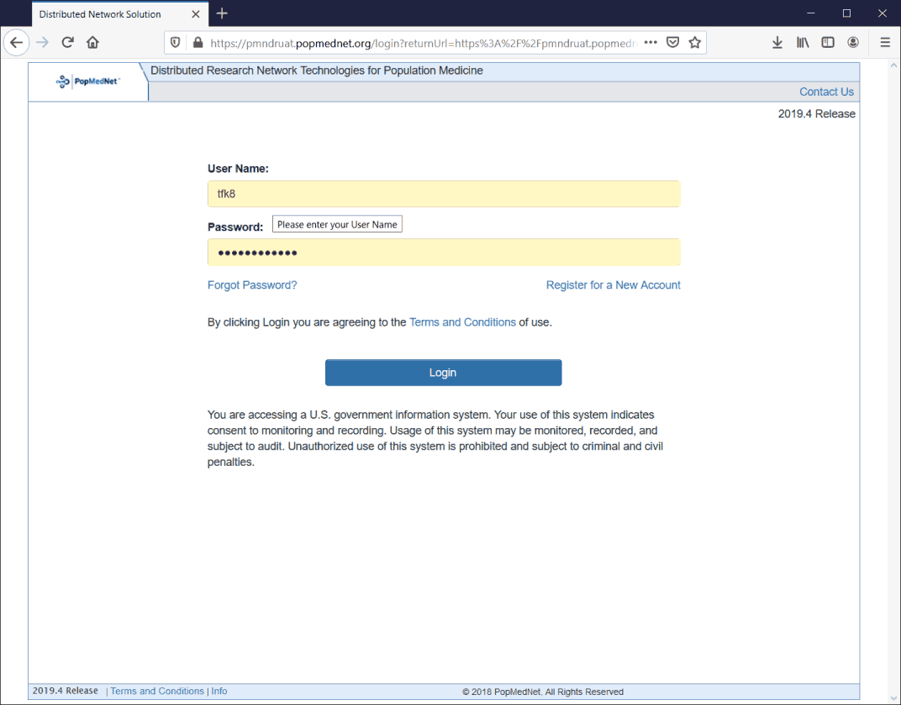
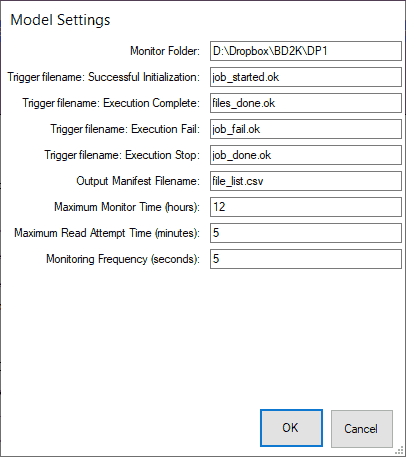
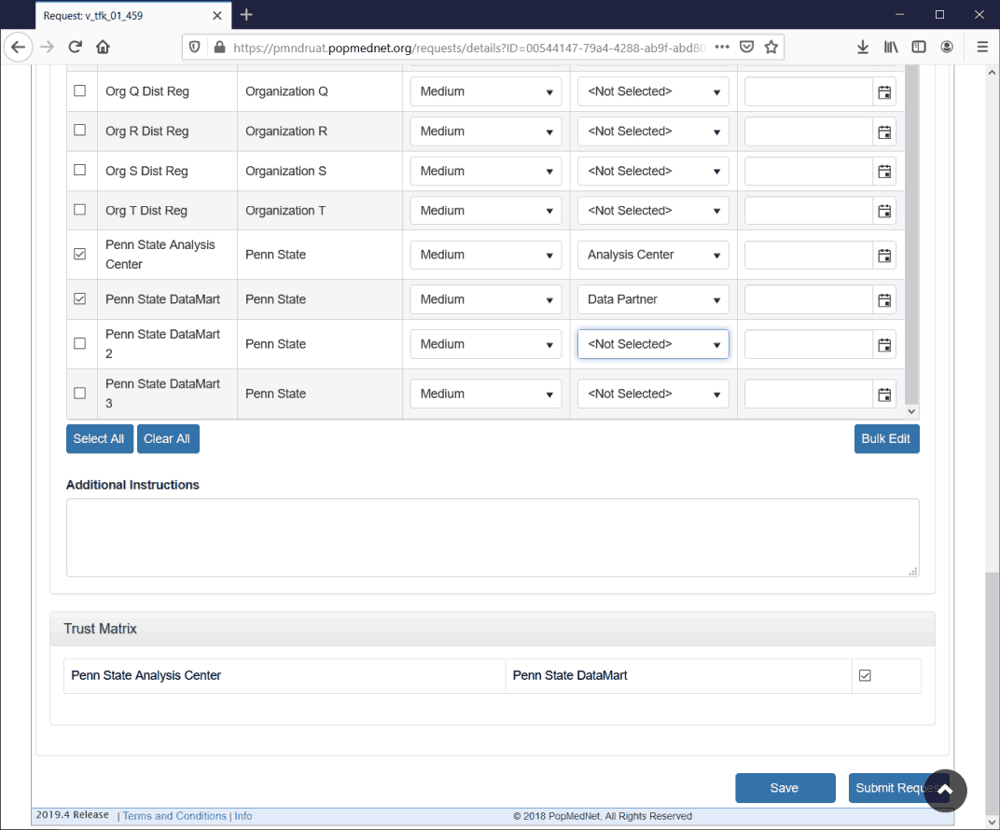

# Introduction

In the vignette "An Introduction to the VDRA package", we discussed how to use the `vdra` package to perform distributed regression on a single machine.  The purpose of that vignette was to help the user become comfortable with using the package and to learn how to run a distributed regression analysis.  However, in a real world setting, we want to be able to use this package to perform vertical distributed regression on data held by two or more data partners where each partner is using a different machine, at a different location, and where the data cannot be aggregated or shared.  The purpose of this vignette is to show you how to do exactly that.  We have written the `vdra` package to be used with PopMedNet, where PopMedNet will take care of the actual communication between the data partners.  

PopMedNet (https://pmnplayground-1.popmednet.org/) short for Population Medicine Network, is a "scalable and extensible open-source informatics platform designed to facilitate the implementation and operation of distributed health data networks."  PopMedNet is maintained by Department of Population Medicine at the Harvard Medical School and the Harvard Pilgrim Health Care Institute.  Through two generous National Institute of Health Grants, we were able to make modification to PopMedNet which allowed us to transmit data between data partners in a secure and automatic fashion.  These modification were made specifically with the intent of the creation of this package.  While this package has been designed to work seamlessly with PopMedNet as a means of communication, it should be possible to use other file transfer software to perform the same task.

We have created this vignette to assist the interested user in learning how to use PopMedNet and the DataMart Desktop Client in order to perform distributed regression with the vdra package.  As the process can be involved, our demonstration is, once again, limited to using a single machine.  However, once the user is comfortable with running distributed regression on a single machine, it is straightforward to apply these same procedures to running a secure vertical distributed regression using several computers at different locations.  All protocols (2-party, $2^T$-party, and $k^T$-party) with all regression types (linear, logistic, and Cox) have been tested by running the code on multiple machines located in different states.  

# System Requirements

The DataMart Client is installed on your local machine and is the interface with the PopMedNet server.  When a distributed regression request is created on the PopMedNet portal, PopMedNet informs the client that the request is active and which DataMarts are being used.  The client then is responsible for transferring files between the local computer and the PopMedNet server.

Currently, the DataMart Client only runs on Windows machines running Microsoft .Net 4.8 or higher.

# Registering for an Account 

In order to use PopMedNet, you must first register for an account.  The service is located at (https://pmnplayground-1.popmednet.org/).  

<!--**Asked Adam about Requested Organization, Requested Roll, turn around time.**-->

Once you register, it may take a few days to get your account set up.  The PopMedNet login page and the registration page are shown below.  We also refer to these pages as the "Portal".

```{r, echo = FALSE, message=FALSE, out.width="75%", fig.align='center', fig.pos='H'}

```

```{r, echo = FALSE, message=FALSE, out.width="75%", fig.align='center', fig.pos='H'}

```

# Creating DataMart Clients

Once you have your account set up, you may already be a part of a project with DataMart Clients already set up.  If so, you can skip this section.  However, if not, you will need to create your own data mart clients.  We will show you how to do this.  If your account does not have permission to create the clients, you will need to contact the system administrator and request that permission be given to you.

Once you log into PopMednet, choose Network and then DataMarts.  Here you will see a list of all DataMarts that have been created for all projects.  Scroll down to the bottom of the page and select "New Request."

```{r, echo = FALSE, message=FALSE, out.width="75%", fig.align='center', fig.pos='H'}

```

```{r, echo = FALSE, message=FALSE, out.width="75%", fig.align='center', fig.pos='H'}
knitr::include_graphics("pmn-11-Add-DataMart-B.png")
```

When creating a client, you must fill out the DataMart Name (it is advisable to make this clear: is this data mart going to function as the Analysis Center or as a Data Mart), Acronym, Organization (Your organization from when you registered), Data Model Supported (None), Adapter Supported (Distributed Regression), Data Partner Identifier ("msoc0" for the analysis center, "msoc1" for Data Partner 1, "msoc2" for Data Partner 2, etc.), the Data Partner Code (0 for the analysis center, 1 for Data Partner 1, etc), and then select "Allow for unattended operation."  Finally, select "Process new request  automatically and upload results."  These last two selections can be overridden by setting in the DataMart Client, which you will install on your Desktop.


We have included screen-shots from our set up for the analysis center (DataMart 0), and DataMarts 1, 2, and 3.


```{r, echo = FALSE, message=FALSE, out.width="75%", fig.align='center', fig.pos='H'}

```

```{r, echo = FALSE, message=FALSE, out.width="75%", fig.align='center', fig.pos='H'}

```

```{r, echo = FALSE, message=FALSE, out.width="75%", fig.align='center', fig.pos='H'}

```

```{r, echo = FALSE, message=FALSE, out.width="75%", fig.align='center', fig.pos='H'}

```

# Setting up the DataMart Client

In order to interface with PopMedNet, each individual on the project needs to install the DataMart Client.  You can download this by clicking on "Resources" from the banner of the PopMedNet homepage.  Select "Download the DataMart client" and your download will begin immediately.  As of the writing of this vignette, the DataMart Client is only available for Windows machines.

```{r, echo = FALSE, message=FALSE, out.width="75%", fig.align='center', fig.pos='H'}

```

Double click on the downloaded file to install.  Make sure you have enough privileges to install the client to your account.  Also, make sure that you have Microsoft .Net 4.8 or higher installed for the client to run correctly.

Once you have the DataMart Client installed, you need to set it up to work with the DataMart Clients that you created in on the portal.  

When you launch the DataMart Client for the first time, you will need to add your network to the client (which in this example is "Distributed Regression").  From the home screen, click on "Settings", and then on the window that pops up, click "Add."  

```{r, echo = FALSE, message=FALSE, out.width="75%", fig.align='center', fig.pos='H'}

```

```{r, echo = FALSE, message=FALSE, out.width="40%", fig.align='center', fig.pos='H'}

```

```{r, echo = FALSE, message=FALSE, out.width="40%", fig.align='center', fig.pos='H'}

```

You will fill in the Network Name, Username, and Password with the information you created in the portal.  The Service URL should be set to (https://pmnplayground-1.popmednet.org/). The X.509 Certificate should be set automatically once you enter your information.  Set the Refresh Rate to 2 seconds (or some short amount of time, but not too short or it will be annoying), and the timeout to 1440 (minutes).    Once you have filled out the information, click "Apply."  If you have entered the information correctly, the DataMarts you created in portal will populate the screen.

```{r, echo = FALSE, message=FALSE, out.width="40%", fig.align='center', fig.pos='H'}

```

We now need to configure the DataMarts you created in the portal to work with the DataMart Client.  For each DataMart you created, select it and click "Edit" (or just double click) and you will open the settings window for that DataMart.  Chose both "Allow unattended operation" and "Process new queries automatically and upload results."  This will cause PopMedNet to automatically upload and download files without human intervention.  You should leave "Enable Response Caching" turned off, since it causes problems with file transfers when it is turned on.  

```{r, echo = FALSE, message=FALSE, out.width="40%", fig.align='center', fig.pos='H'}

```

Once you have filled in these values, click "Edit" to specify where the client will operate when uploading and downloading files.  The following screen-shot is of our PSU Analysis Center (DataMart 0).  The Monitor Folder tells the client where uploads and downloads for a request will be placed.  This is a location that must be created by the user.  If it does not exist, it causes an error with the client.  When a request is created (see the appropriate section below) a subdirectory for the request, named after the id of the request, will be created by the client in this location.  Since the analysis center is also DataMart 0, we have given the name of the lowest level directory `DP0`.  However, you can place the directory wherever you wish, so long as you are consistent with specifying this location when you run the analysis center script.  

However, the next five fields must be filled in as given.  "Trigger filename: Successful Initialization" must be `job_started.ok`, "Trigger filename: Execution Complete" must be `files_done.ok`, "Trigger filename: Execution Fail" must be `job_fail.ok`, "Trigger filename: Execution Stop" must be `job_done.ok`, and "Output Manifest Filename" must be `file_list.csv`.  The final fields are for timing concerns.  "Maximum Monitor Time" tells how many hours the client should wait for the manifest file to be dropped before it decides that the job has failed; "Maximum Read Attempt Time" is the number of minutes spent trying to find the files once the manifest file has been dropped; and "Monitoring Frequency" tells how many seconds the client waits between successive queries to see if the `file_list.csv` and `files_done.ok` have been dropped.  We have used the values of 12 (hours), 5 (minutes), and 5 (seconds) with great success.  

```{r, echo = FALSE, message=FALSE, out.width="40%", fig.align='center', fig.pos='H'}

```

The next three screen-shots show how we have set up DataMarts 1, 2 and 3.  Notice that the only change is that we have made the lowest subdirectories DP1, DP2, and DP3, according to the DataMart number.

```{r, echo = FALSE, message=FALSE, out.width="40%", fig.align='center', fig.pos='H'}

```

```{r, echo = FALSE, message=FALSE, out.width="40%", fig.align='center', fig.pos='H'}

```

```{r, echo = FALSE, message=FALSE, out.width="40%", fig.align='center', fig.pos='H'}

```

# Setting up a Request

Now that you have created your DataMarts and configured them to work with the DataMart Client, you are ready to create a distributed regression request.  In a real-world setting, the analysis center and the data partners would all be located at different sites on different machines.  However, this vignette is focused on a single individual learning the system and so our examples will all take place on a single machine, much like the examples in the vignette "An Introduction to the VDRA Package".  Fortunately, using multiple machines is not much different than using a single machine.  Once we run through our first example, we will point out a couple points you may want to take into consideration when running this code on multiple machines.


The first step is to create the request.  *Generally, the request should be set up by agency which is acting as the analysis center.*   You can get to the screens for creating a new request in two ways.  The first way is to just click on the "New Request" drop down menu button, which is located part way down the home page of the portal, and then select "Distributed Regression."

```{r, echo = FALSE, message=FALSE, out.width="75%", fig.align='center', fig.pos='H'}

```

The second way to  Choose **Request$\rightarrow$Distributed Regression** from the home screen of the portal.  This will take you to a page which shows all of the tasks and requests that have been previously set up.  At the top of the page, click on the "New Request" drop down menu button and then select "Distributed Regression."

```{r, echo = FALSE, message=FALSE, out.width="75%", fig.align='center', fig.pos='H'}

```

```{r, echo = FALSE, message=FALSE, out.width="75%", fig.align='center', fig.pos='H'}

```

In either case, you will bring up a dialog where you can select the request type.  Choose **QE Vertical Distributed Regression**.  The other request types are protocols that are not supported by the vdra package.  Choosing either of them will cause PopMedNet to *not* transfer the files between DataMarts correctly.

```{r, echo = FALSE, message=FALSE, out.width="40%", fig.align='center', fig.pos='H'}

```

The next screen that pops up asks for the request metadata.  For our project, we generally make the Request Name and the Request ID the same, but they do not have to be.  The Request Name can be descriptive, but the Request ID should be an identifier which is also a reasonable file name.  PopMedNet will create a directory with this name of the Request ID under the Monitor Folder for each DataMart (which folder we specified when setting up the DataMarts in Section 5).  PopMedNet will then create the subdirectories `inputfiles`, `msoc`, `msoc1`, etc which are used for transferring files between the data partners.  (See the vignette "An Introduction to the VDRA package" for more information on these directories.)

```{r, echo = FALSE, message=FALSE, out.width="75%", fig.align='center', fig.pos='H'}

```

Once you save the metadata, you will be brought to the request home screen which allows you to specify which DataMarts are going to be used in the computation and to upload any initial files that may need to be shared before the distributed regression is started.  In the screenshot below, we show the top of the request home screen.  You can see where we can upload local files to share with the other DataMarts.  While it is not necessary to upload a file (you will receive a warning that can be ignored if you don't), in truly distributed regression situation it might be desirable to do so.  In particular, the agency in charge of the analysis center could create the scripts that each data partner will run locally in order to process the distributed regression, and then then use this feature to send the files to the data partners.  The files should be zipped into a single file, the name does not matter, and when the initial request is deployed to each data partner through the DataMart Client, the file will be unzipped into the Request ID directory.  When doing this, each data partner should take care to change the name of the monitor folder and the name of the local variable which holds the data to what is correct for them.

```{r, echo = FALSE, message=FALSE, out.width="75%", fig.align='center', fig.pos='H'}

```

The final part of setting up the request is to select the DataMarts which will be used in the computation and to specify the Trust Matrix.  The Trust Matrix determines which DataMarts are allowed to share data directly with each other.  While the code we supply with the package follows the specified trust restrictions on who is allowed to send data to whom, it is possible for a nefarious party to either change the code so as to send data where it should not go, or to manually change a the manifest file (`file_list.csv`) for the same purpose.  The Trust Matrix, when properly setup, ensures that attempts of these sorts will not be successful.  Any file that is sent to a DataMart which violates the trust matrix will not be sent.

In the following three screenshots, we show how to set up a 2-party regression, a $2^T$-party regression, and a $k^T$-party regression with three data partners.  We use our Penn State DataMarts as examples.

For a 2-party regression (linear, logistic, or Cox), we choose two DataMarts, specify one to be the analysis center, and the other to be a data partner.  You must have exactly one DataMart assigned to be the analysis center.  With the trust matrix we check the box to indicate that two parties are allowed to communicate directly with each other.  

```{r, echo = FALSE, message=FALSE, out.width="75%", fig.align='center', fig.pos='H'}

```

For a $2^T$-party regression (linear, logistic, or Cox), we choose three DataMarts and specify one to be the analysis center, and specify the other two to be data partners.   In the Trust Matrix, we check both boxes which allow the analysis center to communicate directly with either data partner, but we do not select the box for direct communication between the data partners, forcing them to only be able to communicate directly with the analysis center.

```{r, echo = FALSE, message=FALSE, out.width="75%", fig.align='center', fig.pos='H'}

```

For a $k^T$-party regression (linear, logistic, or Cox0, we choose three or more DataMarts and specify one to be the analysis center.  In our example, we chose four DataMarts, but it can be as few as three or more than 10.  In the Trust Matrix, we select all boxes which allows all parties to communicate directly with each other.  

```{r, echo = FALSE, message=FALSE, out.width="75%", fig.align='center', fig.pos='H'}

```

At this point save the information, and the portal takes you to the Request Overview page.  This page summarizes what we have done.  The **Terminate** button at the bottom of the page can be used to force PopMedNet to shut down processing of this request and to transfer no more files.  No data partner will be informed that this happened; they will need to receive this information directly from the analysis center and then shut down their local scripts manually.  This is useful if it has been determined that the request has been set up incorrectly, or there is some other unforeseen event that indicates that the computation probably will not complete correctly.

```{r, echo = FALSE, message=FALSE, out.width="75%", fig.align='center', fig.pos='H'}

```

```{r, echo = FALSE, message=FALSE, out.width="75%", fig.align='center', fig.pos='H'}

```

