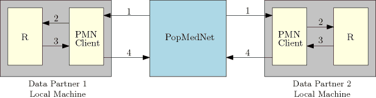

```{r, echo = FALSE, warning=FALSE}
library(knitr)
```

# Introduction

While the `VDRA` package was specifically designed to work with PopMedNet, the intent of this project was to produce a package that could be modified, with some effort, to be used with other automated file transfer programs.  With that end in mind, the purpose of this vignette is to explain how the `VDRA` package and PopMedNet communicate with each other, and also to outline certain design considerations that had to be implemented in the VDRA package due how PopMedNet itself is designed.

The functions that handle the actual communication side of the `VDRA` package can be found in the file `vertical_utilities.R` in the four code sections that contain the phrase "PMN Communication Functions."  Ideally, with the aid of this vignette, modifying those functions appropriately will allow one to interface with different protocols.

# Data Partners and Trusted Third Parties

As outlined in the vignette "An Introduction to the VDRA Package," there are three different protocols for vertical distributed regression analysis (VDRA) implemented in this package.  They are called $2$-party, $2^T$-party, and $k^T$-party. The $2$-party protocol has two parties named `dp0` and `dp1`, the $2^T$-party protocol has three parties named `dp0`, `dp1`, and `dp2`, and the $k^T$-protocol has $k+1$ parties named `dp0`, `dp1`, ..., `dpk`.  The party `dp0` is known as the "Analysis Center" and is monitored by PopMedNet for a signal that indicates when the computation has successfully completed or has failed.  A party which is not the Analysis Center is known as a "Data Partner."  The $T$ in the $2^T$- and $k^T$-protocols stands for "trusted" which indicates the presence of a "trusted third" party which provides no data but assists in the computation.  There is no trusted party for the $2$-protocol, but the party $dp0$ is the trusted party for the other two protocols.  While not important for this vignette, it is also assumed that for the $2$-party protocol, $dp0$ holds the response variable(s), and that for the $2^T$- and $k^T$-party protocols $dp1$ holds the response variable(s).  

```{r, echo = FALSE}
kable(data.frame(Protcol = c("\\(2\\)-party", "\\(2^T\\)-party", "\\(k^T\\)-party"),
`Analysis Center` = c("dp0", "dp0", "dp0"),
`Holds response` = c("dp0", "dp1", "dp1"),
`Data partners` = c("dp1", "dp1, dp2", "dp1, dp2, …, dpk")))
```


While the idea is that each party is running on a different machine in a location remote from the others, this is not necessary.  We have tested this package both with three different parties on three machines located in three states (Illinois, Pennsylvania, and Massachusetts) running a single vertically distributed regression, and two to 10 parties running all on the same desktop computer to solve a single vertically distributed regression.  

# A High-Level View of the Communication Process

PopMedNet is used to facilitate secure communication between clients. In order to do this, a "request" must be set up on PopMedNet.  A request consists of choosing the clients and their roles (analysis center or data partner) to be involved in the distributed regression analysis and sending out an initial payload that will be downloaded to all parties (usually consisting of a script for each party to execute).  Once a request has been created, PopMedNet distributes the payload to each data partner and waits for communication from the clients.  The details of how to set up a request can be found in the PopMedNet help pages.

As of the writing of this vignette, every client which will participate in a distributed regression computation must have the `PMN DataMart Client` running.  The purpose of the DatamMart Client is to provide a communication channel between the computer on which a party is running and the PopMedNet Server.  Currently, the DataMart Client is only available to run on Windows.

A communication round, or step, proceeds as follows.  First, PopMedNet sends files to various clients via the DataMart Client which saves them on the respective remote computers. Once all the files are written to a specific computer, the local DataMart Client writes a trigger file that indicates that all the files have arrived.  The local computer is running the R script which was sent to it.  This script reads the files, performs some computations, and writes some new files along with a file that specifies the party to which each of the files should be sent, and a trigger file that indicates to the DataMart Client that all the files have been written.  The client reads these files and sends them to PopMedNet. Once all the files have been received by PopMedNet from all parties to which files had been sent, PopMedNet sends all of the incoming files to their respective target parties (via the appropriate client), and the process begins all over again. 

Each client can  send a special file to PopMedNet that indicates it is shutting down and no longer expects to receive any more files.  Once this file is sent, the local DataMart Client ceases to scan for more incoming files.  When the analysis center (`dp0`) indicates that it is shutting down, PopMedNet considers the computation complete and will terminate the request.

```{r, echo = FALSE, message=FALSE, out.width="75%", fig.align='center', fig.pos='H'}

```

# The Local Directory Structure

The DataMart Client is configured to both read from and write to a specific directory on the machine to which each party is running.  When running this R-script, this directory is set using the parameter `monitorFolder`.  The author of the package prefers to use the directories `D:/vdra/dp0`, `D:/vdra/dp1`, etc. for data partners `dp0`, `dp1`, etc. respectively.  More information on configuring the DataMart Client can be found in the vignette "How to Use the VDRA Package with PopMedNet".

Every request initiated by PopMedNet has a unique Request ID.  When a DataMart Client receives the initial payload from PopMedNet, it will create a sub-directory under `monitorFolder` which is named after the Request ID.  The Request ID is specified in the R-script using the parameter `msreqid`.  This allows a single client to start with a clean directory structure each time it participates in a new request from PopMedNet.  (If the PopMedNet simulator `pmn()` is being used to test out the package instead of PopMedNet, then `msreqid` is not included in the directory structure.)


The directory specified by `msreqid` contains the further sub-directories `inputfiles`, `msoc`, `msoc1`, $\dots$, `msoc(k)`.  The analysis center (`dp0`) writes files to `inputfiles` and the data partners all write files to `msoc`.  For all clients (both the analysis center and the data partners), files which are received from the analysis center are written to `inputfiles`, files which are received from `dp1` are written to `msoc1`, files which received from `dp2` are written to `msoc2`, etc.  


Three other folder, `dplocal`, `macros`, and `rprograms`, are included in the directory structure for historical reasons, but are not used for communications.

```
Directory Structure

└───monitorFolder
    └───msreqid
        ├───inputfiles
        ├───msoc
        ├───msoc1
        ├───msoc2
        ├───msoc3
        ├───dplocal
        ├───macros
        └───rprograms
```

```{r, echo = FALSE}
kable(data.frame(`Write Directory` = c("inputfiles", 
                                       "msoc"),
                `Client Writing files` = c("dp0", 
                                           "dp1, dp2, dp3")),
      caption = "Where each client write files.")

kable(data.frame(`Read Directory` = c("inputfiles", 
                                      "msoc1", 
                                      "msoc2", 
                                      "msoc3"),
                `Client which sent the files` = c("dp0", 
                                                  "dp1", 
                                                  "dp2", 
                                                  "dp3")),
      caption = "Where files from each client are read.")
```

# Files used for Communication

PopMedNet is designed to work with four types of files: .zip, .rdata, .csv, and .ok.  In current usage of this project, .zip files are only used to distribute the initial package, which could just contain the scripts the clients are expected to run or even the full directory structure as described above.  Files with the suffixes .rdata and .csv are used to transfer data between clients and to PopMedNet, while files with the suffix .ok are used as trigger files to indicate that some action needs to be taken.  This section describes the files which are used to control communication between the clients and PopMedNet.  

1. Trigger files.  Trigger files do not need to contain any information; it is the name of the file which indicates the action to be taken.

    a. `files_done.ok`: After the last file has been transferred from PopMedNet to the client, the DataMart Client writes the file `files_done.ok` to the same directory.  This is used as a trigger file to indicate to the R-script that the it can begin reading files.  The R-script deletes this file once it sees it in order to prepare for the next round of reading files.  After the R-script finishes writing all the data files it needs to send, it writes `files_done.ok` to the same directory to which the files were written.  This signals the DataMart Client that the files are ready to be transferred to PopMedNet.  The DataMart Client deletes this file once it begins transferring files. 

    b. `job_started.ok`: The first time a client writes files, it should use `job_started.ok` instead of `files_done.ok`.  However, this is not actually enforced by PopMedNet nor the DataMartClient.

    c. `job_done.ok`: A client writes this file to indicate that its role in the vertical distributed regression request is complete and that it is quitting.  The DataMart Client will cease to send files to or accept files from PopMedNet.

    d. `job_fail.ok`: Similar to `job_done.ok` but additionally indicates that the client is quitting due to encountering an error.  

2. `file_list.csv`: This file tells PopMedNet where to send the data files that it is receiving from the client.  This file has three columns: `file_nm`, `transfer_to_site`, and `dp_cd_list`.

    a. `file_name`: The name of the file which is being transferred.  Not only does it include the data files which are to be transferred to other clients, but it should also include `file_list.csv` as well as `job_done.ok` or `job_fail.ok` if they exist.
    
    b. `transfer_to_site`: Takes on the value of 1 if the file is being sent to a data partner or 10 if the file is being sent to PopMedNet. `file_list.csv`, `job_done.ok`, and `job_fail.ok` are sent to PopMedNet and so should have a value of 10.
    
    c. `dp_cd_list`: The code of the data partner to which the file is being sent.  That is, it is 0 if the file is being sent to the Analysis Center (`dp0`), 1 if it is being sent to Data Partner 1 (`dp1`), etc.

```{r, echo = FALSE}
kable(data.frame(`file_nm` = c("stats.rdata",
                               "stamps.rdata",
                               "log.rdata",
                               "stats.rdata",
                               "stamps.rdata",
                               "log.rdata",
                               "file_list.csv",
                               "dl_track_tbl.csv"),
                 `transfer_to_site` = c("1",
                                        "1",
                                        "1",
                                        "1",
                                        "1",
                                        "1",
                                        "10",
                                        "10"),
                 `dp_cd_list` = c("1",
                                  "1",
                                  "1",
                                  "2",
                                  "2",
                                  "2",
                                  "10",
                                  "10")), 
      caption = "file_list.csv for sending files from dp0 to both dp1 and dp2.")
```

```{r, echo = FALSE}
kable(data.frame(`file_nm` = c("dl_track_tbl.csv",
                               "file_list.csv",
                               "job_done.ok"),
                 `transfer_to_site` = c("10","10","10"),
                 `dp_cd_list` = c("10","10","10")), 
      caption = "file_list.csv for dp0 ending the PopMedNet request.")
```

3. Other files:  The files `dl_track_tbl.csv`, `log.rdata`, `stamps.rdata`, and `tr_tb_updt.rdata` are used for logging the activity of the different clients for diagnostic purposes and so are not outlined here.  Final copies of these files named `log.csv`, `log_summary.csv`, and `stamps.csv` are saved in the work directories.  Generally, they record what functions are run by each client during each round and which data files are sent to which clients.  They are also useful for debugging purposes. 

4. `empty.rdata`: This is not a required file, but rather a feature of PopMedNet.  For a client to act during a round or step (which can include processing or sending files), it must first receive a file.  However, PopMedNet does not allow a client to send a file to itself.  This can be problematic if a client needs to act and send files for two rounds in a row but there is no active client during the first round to send it a data file.  To get around this difficulty, we would send `empty.rdata` to an otherwise dormant client to wake it up so it could send `empty.rdata` to the original client in order to allow it to process for two rounds in a row.  It is hoped that in future versions of PopMedNet, a more efficient mechanism will be implemented which allows a client to either send a file to itself or to indicate to PopMednet that it will be sending files during the next round even if it doesn't receive a file.

